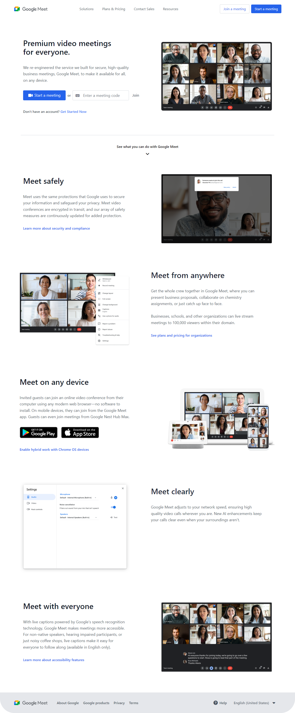

<div align="center">
  
  <h2 align="center">Responsive Google Meet Clone</h2>

In this project, I have created Responsive Google Meet Clone, The project is built using Tailwind CSS.

<a href="https://pankajkumar90.github.io/Google-Meet-Clone/"><strong>➥ Live Demo</strong></a><br/>
<a href="https://www.youtube.com/watch?v=hLm2wU_In70/"><strong>➥ YouTube Tutorial</strong></a>

</div>

### Demo Screeshots



### Prerequisites

Before you begin, ensure you have met the following requirements:

- [Git](https://git-scm.com/downloads "Download Git") must be installed on your operating system.

### Run Locally

To run **responsive-google-meet-clone** locally, run this command on your git bash:

Linux and macOS:

```bash
sudo git clone https://github.com/Pankajkumar90/Google-Meet-Clone.git
```

Windows:

```bash
git clone https://github.com/Pankajkumar90/Google-Meet-Clone.git
```

### Contact

If you want to contact me you can reach me at [YouTube](https://www.youtube.com/c/CodeWithPankaj1?sub_confirmation=1).

### License

This project is **free to use** and does not contains any license.
