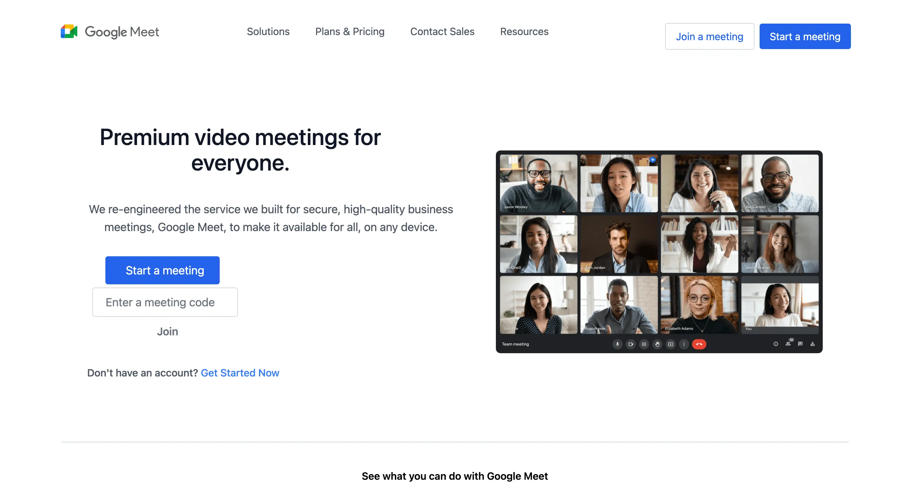

# Google Meet Clone

A Google Meet clone project built using HTML, CSS, Tailwind CSS, and JavaScript. The project is responsive and works well on all devices, including mobile, tablet, and TV.

<a href="https://www.youtube.com/watch?v=hLm2wU_In70/"><strong>➥ YouTube Tutorial</strong></a>

<hr>

💙 Join the channel to see more videos like this. [Code_With_Pankaj](https://www.youtube.com/c/CodeWithPankaj1?sub_confirmation=1)

<hr>

<div align=center>

## Must visit 👇 (Click on it)

[](https://www.youtube.com/c/CodeWithPankaj1?sub_confirmation=1)

</div>

<hr>

## Features

- A responsive design.
- Effect of hovering.
- The width of the device will be automatically fixed.

# Usage

To use the project, simply open the index.html file in your web browser.

## Authors

- [@pankajbaliyan](https://www.github.com/pankajbaliyan)

## Contributing

This project is open for contributions. If you would like to contribute to this project, you can fork the repository and submit a pull request.<br>
Contributions are always welcome!

See `index.html` for ways to get started.

Please adhere to this project's `code of conduct`.

## Demo

https://google-meet-clone-cwp.vercel.app
<br><br>
https://pankajbaliyan.github.io/Google-Meet-Clone/

## Feedback

If you have any feedback, please reach out to us at pankajbaliyan90@gmail.com

## 🔗 Links

[](https://www.linkedin.com/in/pankaj-kumar-90/)

<br>

[](https://codewithpankaj.vercel.app)

## Lessons Learned

Understanding web technologies: By using HTML, CSS, Tailwind CSS, and JavaScript, you gained a deeper understanding of how these technologies work together to create a web application.

Responsive design: By ensuring that your project is responsive and works well on all devices, you gained experience in designing for a variety of screen sizes and resolutions.

Cloning existing products: By creating a clone of an existing product like Google Meet, you gained experience in reverse engineering and understanding how existing web applications work.

Version control: By using Git to manage your project and push it to a GitHub repository, you gained experience in version control and collaborating with others on code.

## Run Locally

Clone the project

```bash
  git clone https://github.com/PankajBaliyan/Google-Meet-Clone.git
```

Go to the project directory

```bash
  cd Google-Meet-Clone
```

Start code editor

```bash
  code .
```

## Screenshots



## Support

For support, email pankajbaliyan90@gmail.com or join our Slack channel.

## License

This project is licensed under the <a href="https://opensource.org/licenses/MIT">MIT License</a>.
